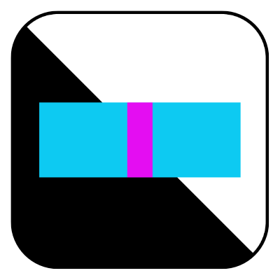
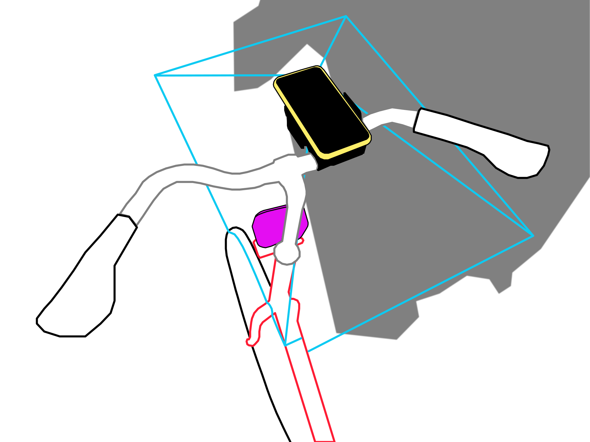
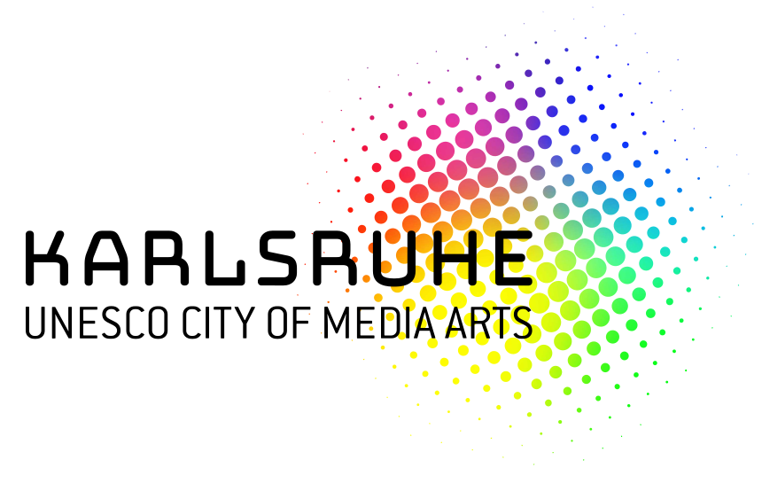

ShadowPlay
==========

Copyright (c) [Dan Wilcox](danomatika.com) 2021

BSD Simplified License.

For information on usage and redistribution, and for a DISCLAIMER OF ALL
WARRANTIES, see the file, "LICENSE.txt," in this distribution.

Description
-----------

ShadowPlay is an exploration of architecture and light in outdoor spaces through sound. Using a bicycle-mounted sensor and a smartphone aimed skywards, the mottled patterns of light and shadow become the musical score and one rides along their city streets.

Basic Usage
-----------

1. Place device in bicycle mount with active camera uncovered (either front or rear)
2. Open ShadowPlay application
3. Calibrate:
  a. Open ... -> Calibrate
  b. Press the Start button
  c. Roll bike over both light and dark areas
  d. Press Stop button when finished
4. Choose audio scene in Scenes table
5. Ride through areas of light and dark to trigger scene audio

When using the front camera facing upwards, try riding directly under trees, bridges, or overhanging objects to affect the brightness.

For a user friendly info: [ShadowPlay Tutorial PDF](http://danomatika.com/projects/shadowplay/shadowplay-tutorial.pdf) and [ShadwoPlay version 1.0.0 screen recording MOV](http://danomatika.com/projects/shadowplay/shadowplay-screen-recording.mov)

See `tutorial.txt` and `composerpack/README.txt` for additional usage and scene composition details.

Developing
----------

### Dependencies

* [libpd](http://github.com/libpd/libpd): included as a git submodule

### Checkout & Build

Clone this repository and checkout it's submodules using git:

    git clone https://github.com/danomatika/ShadowPlay.git
    git submodule update --init --recursive

Open the Xcode project and Build/Run.

### Release steps

1. Update version in Xcode project and changelog
2. Update changelog with relevant changes
3. Archive and distribute to App Store Connect
4. Tag version

Acknowledgments
---------------

Supported through the UNESCO City of Media Arts Karlsruhe as well as through the City of Karlsruhe. / Unterstützt durch die UNESCO City of Media Arts Karlsruhe sowie durch die Stadt Karlsruhe.

Sound scene contributions by:

* Sofy Yuditskaya (New York, USA) <https://www.yuditskaya.com>
* Damian Stewart (Vienna, AT) <http://damianstewart.com>
